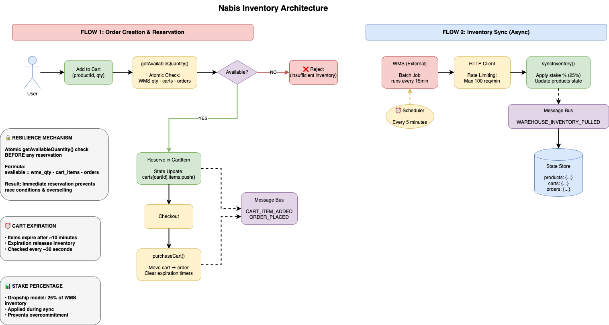
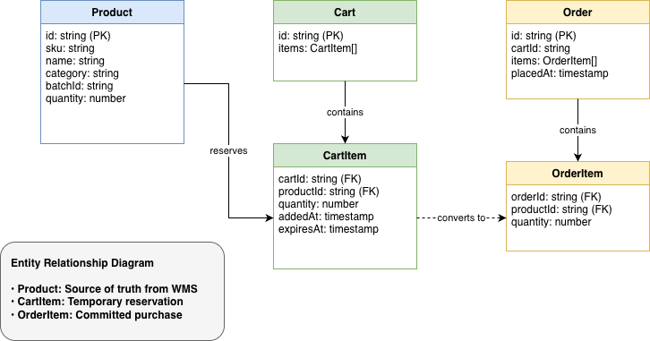

# Nabis Inventory Management Strategy

## Core Assumptions

We're working within a drop-shipping model where the actual inventory is out of our control. The product inventory is 
shared and being sold by other merchants as well, which means competitors may take some percentage of 
available inventory at any moment.

## Calculating Safe Inventory Levels

We can refine our understanding of available inventory by running a report that considers and calculates a few key factors. 
First, we need to look at how much of a particular product we move typically or seasonally. Then we factor in how many 
direct competitors we have and assume they move about the same, give or take.

From there, we multiply those numbers, remove our take, and what's left is our approximate safe inventory threshold.

Here's an example of how this works: let's say we sell 4oz of OG Kush daily on average, and we have 3 direct competitors 
who we can assume sell about the same amount, so that's 12oz total. We can then infer we have about a 25% stake in the inventory.

## Handling Overreach

Any overreach beyond our stake needs to be handled by UX. Supporting back-orders can eat into the following 
day's inventory stake and introduce a lot of complexity, so I typically recommend presenting alternative products instead. 
Think top sellers that are always in stock, or slow movers with an inconvenience discount applied. There are several options to consider, 
like store credit for future orders.

## Using This to Our Advantage

The constraint actually gives us some leverage. FOMO drives sales, so we get to put more "hurry, almost out of stock" CTAs 
throughout the experience. We control the percentage and lock it down at the cart level, meaning we should assume that orders placed 
after we cross our stake threshold will bounce. This helps us avoid fulfillment claims down the line.

We need to have a strategy in place for "out-of-stock" situations and let the user decide ahead of time with an option menu. 
The customer can agree to swap their item with a similar one, or they can agree to accept store credit for future orders. 
Either way, they're making the choice upfront rather than dealing with disappointment later.

# Architecture

This is the proposed architecture starting point. It's not meant to be dogmatic or exclusive. Lots of ways to accomplish this, and we can 
consider what options make sense on the existing Nabis infrastructure. 




# Demo Walkthrough

This demo proves the inventory management strategy can prevent overselling in a shared inventory environment by simulating 
real-world race conditions between competing orders.

## What I'm Proving

The core challenge is that the WMS updates inventory via batch jobs every 15 minutes, creating a window where data can be stale. 
During this window, multiple orders could theoretically claim the same inventory, leading to overselling and failed fulfillments. 
This demo shows how I've solved that by maintaining real-time availability tracking based on a calculated stake percentage.

## How the Demo Works

I start with a realistic scenario: the WMS has 100 units of OG Kush in total inventory. For this demo, I'm using a 25% stake 
calculation as an example scenario, which would represent a case where there are roughly 3 direct competitors sharing the same 
inventory pool. In production, this percentage would be determined by analyzing actual market share, competitor count, and historical 
sales data, but the math and logic apply regardless of the specific percentage used.

The demo then simulates the exact race condition we're trying to prevent. User 1 adds 15 units to their cart, which succeeds and 
reduces available inventory to 10 units. Immediately after, User 2 attempts to add 15 units to their cart. This is where the system 
proves its value: User 2's request is blocked because only 10 units remain in our stake. The system prevents the oversell before it 
happens, not after.

User 2 then adjusts their request to 10 units, which succeeds. Both users complete their purchases, and the orders are submitted to the 
WMS for fulfillment. At this point, we've sold exactly our 25% stake and available inventory reads zero.

## What This Solves

This demonstrates that I'm tracking inventory atomically at the cart level, meaning inventory is reserved the moment it's added to a 
cart, not when the order is placed. This prevents the race condition entirely. The implementation also respects the calculated stake 
percentage, which means we're only claiming what we can reliably fulfill based on market share analysis.

I've also built in cart expiration handling. When items sit in a cart beyond the expiration time (configured at 10 minutes in the demo), 
those reserved units are released back into available inventory so other customers can purchase them. This prevents inventory from being 
indefinitely locked by abandoned carts or slow shoppers. When a customer does complete their purchase, their claimed quantity is 
accounted for locally, and we trust the WMS source will reflect that change on the next sync cycle.

The key is that we're not waiting for the WMS to tell us what's available every 15 minutes. I've designed the system to maintain its 
own real-time count based on the initial sync, stake calculation, and order activity. When the WMS does sync, we reconcile any 
discrepancies, but in the meantime we're operating within safe boundaries that prevent overselling.

This approach gives us the control we need to avoid fulfillment claims while still operating in a shared inventory model where we 
don't control the actual warehouse stock.

## Running The Demo

```bash
npm install
npm run dev
```

## Testing The Logic
I ran out of time, but I tried to get most of the coverage around the core logic and some of the utility functions.

```bash 
npm test
```
